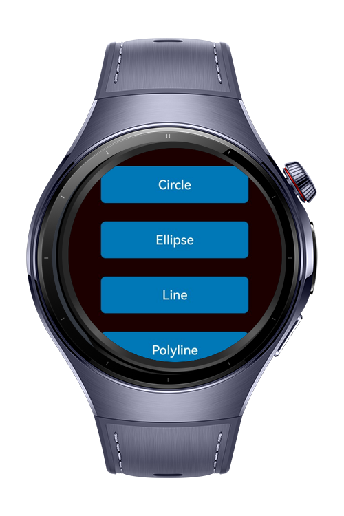
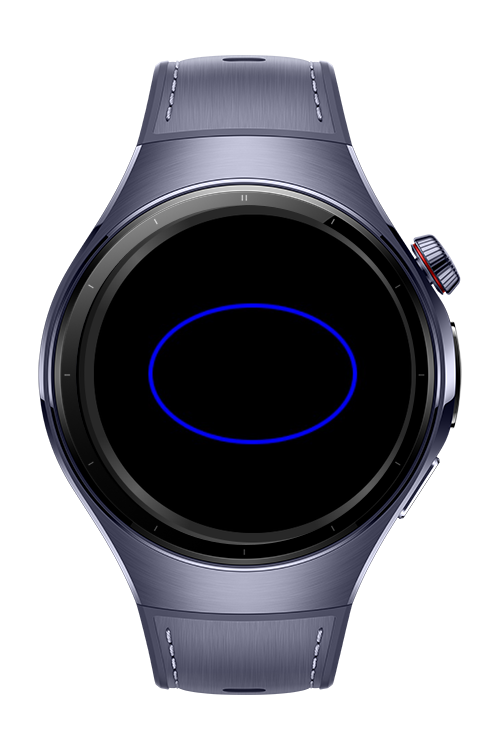
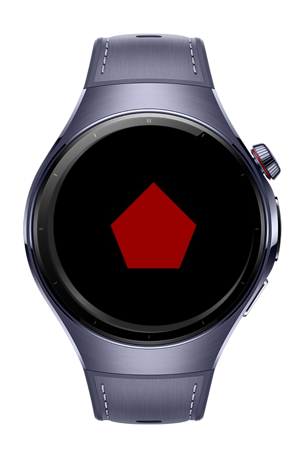

> **Note:** To access all shared projects, get information about environment setup, and view other guides, please visit [Explore-In-HMOS-Wearable Index](https://github.com/Explore-In-HMOS-Wearable/hmos-index).

# How to Draw a Graphic 
This project demonstrates how to draw a graphic on HarmonyOS Next devices.

# Preview
<div>
  
  
  
</div>

# Use Cases

- **Index**: A list that shows all components to draw a graphic.
- **Circle**: The Circle component is used to draw a circle.
- **Ellipse**: The Ellipse component is used to draw an ellipse.
- **Line**: The Line component is used to draw a straight line.
- **Path**: The Path component is used to draw a custom closed shape based on a specified drawing path.
- **Polygon**: The Polygon component is used to draw a polygon.
- **Polyline**: The Polyline component is used to draw a polyline.
- **Rect**: The Rect component is used to draw a rectangle.
- **Shape**: The Shape component is the parent component of the drawing components.

# Tech Stack

- **Languages**: ArkTS
- **Frameworks**: HarmonyOS SDK 5.1.0(18)
- **Tools**: DevEco Studio Vers 5.1.0.842
- **Libraries**: @kit.ArkUI

# Directory Structure
   ```
entry/src/main/ets/
|---pages
|---|---Circle
|---|---Ellipse
|---|---Index
|---|---Line
|---|---Path
|---|---Polygon
|---|---Polyline
|---|---Rect
|---|---Shape
|---entryability
|---|---EntryAbility
|---entrybackupability
|---|---EntryBackupAbility
   ```

# Constraints and Restrictions
## Supported Devices
- Huawei Watch 5
# License
**How to Draw a Graphic** is distributed under the terms of the MIT License
See the [LICENSE](./LICENSE) for more information.
